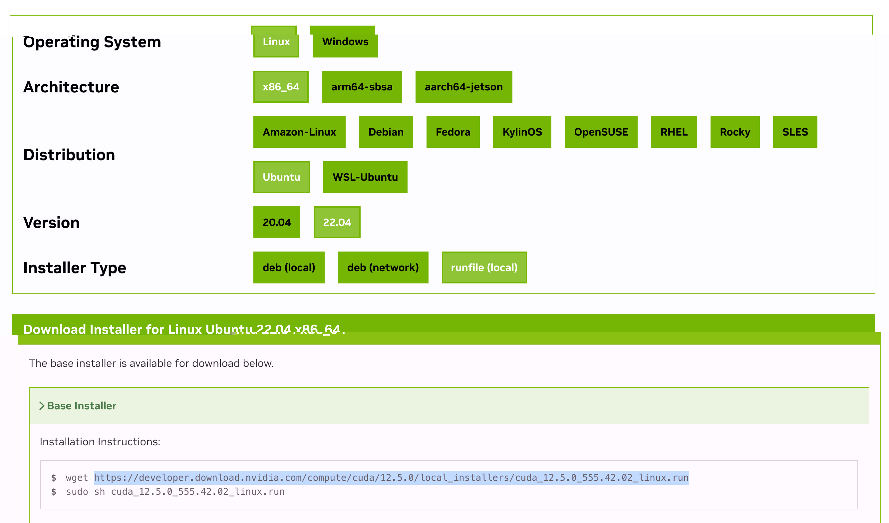
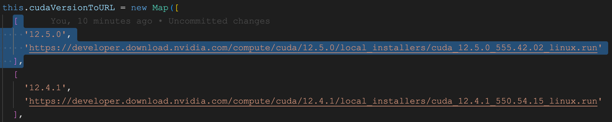
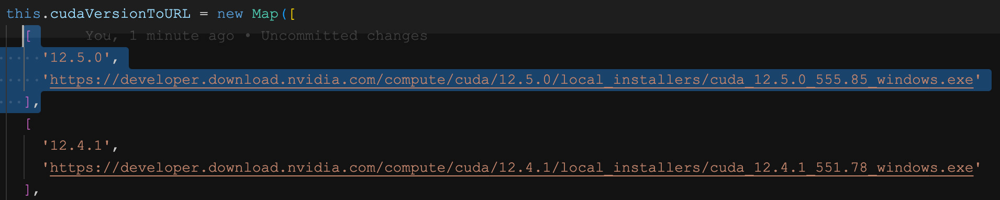
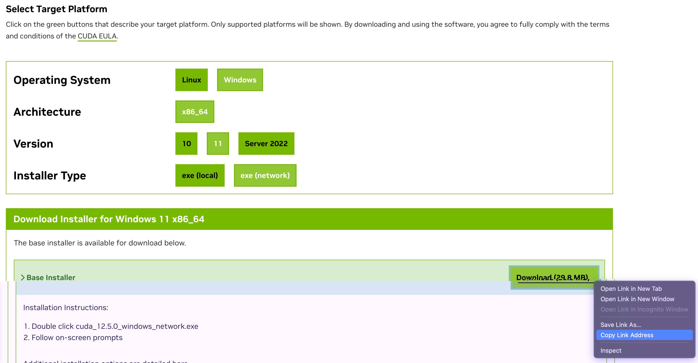

# Contributing

## Adding new CUDA versions

All CUDA versions are visible on the
[NVIDIA CUDA toolkit archive](https://developer.nvidia.com/cuda-toolkit-archive)

When adding new versions, the following files should be updated:

- `src/links/linux-links.ts`

  To get the linux link you should get the link for the `runfile (local)`
  option, the distribution doesn't matter as long as the architecture is
  `x86_64`, see the image below:  Copy
  the link and paste it in a new entry of the `cudaVersionToURL` map:
  

- `src/links/windows-links.ts`

  There are two windows links, one for the network installer (online) and one
  for the local installer (offline):

  The installer links can be copied by selecting the Windows platform, OS
  version doesn't matter (at the time of writing), and then select either
  `exe (local)` for the local installer, and `exe (network)` for the online
  installer. The link can be copied by right clicking the green `Download`
  button and selecting `Copy Link address`.

  #### Windows - Local installer:

  

  Then add a new entry in the `cudaVersionToURL` map with the link copied above:
  

  #### Windows - Network installer:

  

  Add a new entry in the `cudaVersionToNetworkUrl` map with the link copied in
  the above: 
